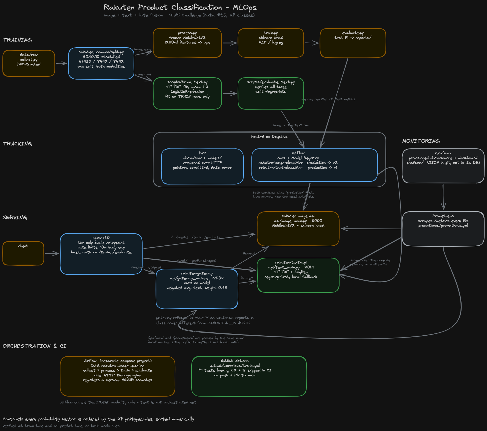

# Rakuten Product Classification — MLOps (image + text + fusion)

This repository holds the **MLOps phase** of our group's *Rakuten France
Multimodal Product Data Classification* project (ENS Challenge Data #35). It
predicts a product `prdtypecode` (27 classes) from a product **image**, from its
**text** (designation + description), or from **both** via late fusion.



*Source: [`docs/architecture.excalidraw`](docs/architecture.excalidraw) — open it
at [excalidraw.com](https://excalidraw.com) and re-export the PNG after any
change.*

This is a deliberately **lighter re-implementation** of the modelisation work
(which trained LeNet / VGG16 / EfficientNetB3 on a rented H100). Instead of
training a heavy CNN it uses a **frozen MobileNetV2 backbone as a feature
extractor** with a small scikit-learn head, and a **TF-IDF + LogisticRegression**
text model. That choice is what makes the whole thing run on a modest laptop
(2 cores, 8 GB RAM) and makes the `/train` endpoint return in seconds.

The deliverable is a **working, reproducible, observable pipeline** — not a new
SOTA score.

---

## Results (measured, not estimated)

All figures come from the shared held-out **test** split (8492 products the
models never saw), except the image number, which is the val figure recorded in
the registry.

| model | accuracy | f1_weighted | f1_macro |
|---|---|---|---|
| image (MobileNetV2 + MLP head) | – | **0.5468** *(val)* | – |
| text (TF-IDF + LogReg) | 0.7768 | **0.7780** | 0.7564 |
| **fusion @ text_weight 0.85** | **0.7990** | **0.7973** | 0.7794 |

Fusion beats text alone by **+0.0193 weighted F1**.

### The fusion weight was measured, not guessed

`scripts/tune_fusion_weight.py` sweeps the weight on the **val** split:

| text_weight | f1_weighted | |
|---|---|---|
| 0.00 | 0.5468 | endpoint check — must equal image alone |
| 0.50 | 0.6621 | the old default: **worse than text alone**, silently |
| **0.85** | **0.7945** | chosen |
| 1.00 | 0.7818 | endpoint check — must equal text alone |

The curve is flat between 0.80 and 0.90, so 0.85 is not a knife-edge fit, and
test came out *above* val, so it did not overfit val. The two endpoint checks are
printed on every sweep: if weight 0.0 does not reproduce the image model exactly
and 1.0 does not reproduce the text model exactly, the fusion code is wrong and
the curve means nothing.

Weakest text classes by F1: `1180 Jeux de table` 0.40, `10 Livre usagé` 0.50,
`1280 Jouets enfants` 0.57. Strongest: `2905 Jeux pour PC` 1.00,
`2583 Équipement de piscine` 0.95, `1920 Mobilier` 0.91.

---

## The shared split, and why it matters

Both modalities are trained and scored on **one** 80/10/10 stratified split,
produced by `src/rakuten_common/split.py` and keyed by **row label**, not
position:

```
train 67932   val 8492   test 8492
```

This is not a detail. Before it existed, the text model's 80/20 validation set
was **exactly the image pipeline's val + test blocks combined** (8492 + 8492 =
16984 rows) — text was being scored on rows the image pipeline held out, so the
two numbers were never comparable and fusion could not be evaluated honestly.

Guarantees now enforced in code:

- **No leakage.** The TF-IDF vectorizer is fit on the 67932 training rows only.
- **Guarded merge.** Modalities are merged on the ID column with a row-count
  guard and a duplicate-id check, never by row position.
- **Fingerprints.** `models/text/split.json` stores a SHA-256 of all three
  splits; `scripts/evaluate_text.py` verifies **all three** before scoring, so a
  change confined to training rows cannot pass unnoticed.
- **Proof, not assertion.** `scripts/check_split.py` demonstrates on the real
  data that the shared module reproduces `rakuten_img.data.split_dataframe`
  exactly — identical index, order and membership, 27 classes in each split.

### Canonical class order (the fusion contract)

> Every probability vector produced anywhere in this repo is ordered by
> `config.CANONICAL_CLASSES` — the 27 `prdtypecode`s sorted **numerically**.

Verified at train time (training aborts if `classes_` disagrees) and at predict
time. The fusion gateway **refuses to fuse** if an upstream reports a different
order. `tests/test_contract.py` covers this.

---

## Project structure

```
rakuten-image-mlops/
├── data/raw/                  # collect.py lands raw data here (gitignored, DVC-tracked)
├── data/processed/            # cached feature .npy + meta (gitignored)
├── models/                    # image_classifier.joblib + models/text/ (DVC-tracked)
├── reports/                   # metrics, classification reports, confusion matrices
├── docs/architecture.*        # the diagram above (source + exported PNG)
│
├── src/rakuten_common/        # modality-agnostic: no torch, no estimators
│   ├── split.py               # THE split: load, split, split_labels
│   ├── contract.py            # to_canonical(), validate_vector()
│   ├── features.py            # cached-feature row -> productid mapping, re-verified
│   ├── fusion.py              # weighted_average(), DEFAULT_TEXT_WEIGHT = 0.85
│   └── observability.py       # pure-ASGI Prometheus middleware (no fastapi import)
├── src/rakuten_img/           # image modality
│   ├── config.py  images.py  data.py
│   ├── backbone.py            # frozen MobileNetV2 (the only module importing torch)
│   ├── classifier.py          # build/save/load head, registry publish/pull, reorder
│   └── ens_download.py
├── src/rakuten_text/          # text modality (library only, no entrypoints)
│   ├── config.py  preprocessing.py  predict.py
│   └── tracking.py            # all MLflow code for this modality
│
├── scripts/                   # EVERY entrypoint lives here, both modalities
│   ├── collect.py  process.py  train.py  evaluate.py  predict.py   # image
│   ├── train_text.py  evaluate_text.py                             # text
│   ├── promote.py             # the ONLY thing that moves the production alias
│   ├── check_split.py         # proves the shared split matches the image split
│   ├── tune_fusion_weight.py  # measures the fusion weight
│   └── check_ci_pins.py       # requirements-ci.txt must not drift
│
├── api/image_main.py          # FastAPI :8000  /predict /train /evaluate /health
├── api/text_main.py           # FastAPI :8001  /predict /predict/batch /health
├── api/gateway_main.py        # FastAPI :8002  /predict (fusion) /health
├── nginx/default.conf         # the only public entrypoint
├── prometheus/prometheus.yml  # scrape config (bind-mounted, needs a restart to reload)
├── grafana/provisioning/      # datasource + dashboard provider, read-only
├── grafana/dashboards/        # dashboard JSON, versioned here not in Grafana's DB
├── airflow/dags/              # rakuten_image_pipeline
├── .github/workflows/tests.yml
├── tests/                     # 79 tests, torch-free and data-free
└── requirements.txt  requirements-ci.txt  pytest.ini  Dockerfile  docker-compose*.yml  Makefile
```

---

## Layout convention

The two modalities were shaped differently for a while — text was ported from a
standalone repo and kept its own habits. They now follow one rule set, written
down here because a convention nobody wrote down is how the drift happened:

1. **Packages under `src/` are libraries.** They export functions and classes
   and contain no `if __name__ == "__main__"` block.
2. **`scripts/` holds every entrypoint, for every modality.** Anything you run
   is `python scripts/<something>.py`, never `python -m <package>.<module>`.
3. **One `tracking.py` per modality** for all MLflow code.
4. **One Makefile target per task per modality.**
5. **Anything both modalities need lives in `rakuten_common/`** — that is why
   `split_fingerprint` is there and not in a text module.

Image entrypoints keep their bare names (`train.py`) and text ones take a
`_text` suffix (`train_text.py`). Renaming the image scripts purely for
symmetry would churn the Makefile, the README and the DAG's error messages
without making anything work better.

| task | image | text |
|---|---|---|
| collect | `make collect` / `scripts/collect.py` | shares the same raw data |
| process | `make process` / `scripts/process.py` | n/a (no feature cache) |
| train | `make train` / `scripts/train.py` | `make train-text` / `scripts/train_text.py` |
| evaluate | `make evaluate` / `scripts/evaluate.py` | `make evaluate-text` / `scripts/evaluate_text.py` |
| predict | `make predict IMG=…` / `scripts/predict.py` | via the API or `TfidfPredictor` |
| serve | `make serve` / `api/image_main.py` | `api/text_main.py` |

---

## Setup (WSL2 + venv)

PyTorch is installed separately because the correct wheel is hardware-specific.

```bash
make setup            # creates .venv, installs CPU torch + requirements
# or manually:
python3 -m venv .venv && source .venv/bin/activate
pip install torch==2.2.2 torchvision==0.17.2 --index-url https://download.pytorch.org/whl/cpu
pip install -r requirements.txt
```

Run the tests (need neither torch nor data):

```bash
make test             # 79 tests
```

> **Pins are load-bearing.** `numpy` stays `<2` because torch 2.2.2 requires it,
> and `scikit-learn==1.4.2` is required because `classifier.py` passes
> `multi_class=` to `LogisticRegression`, which newer versions removed. On
> scikit-learn 1.9 the suite fails with `TypeError: ... unexpected keyword
> argument 'multi_class'`. Fix the source before moving that pin.

---

## Usage

### Image pipeline

```bash
# 1. Acquire raw data into data/raw/ (idempotent; re-runs are no-ops)
python scripts/collect.py --source /path/to/rakuten/data      # local folder or .zip
python scripts/collect.py --from-ens                          # authenticated ENS download
dvc pull                                                      # or: the exact versioned data

# 2. Extract & cache MobileNetV2 features (the long step; resumable)
python scripts/process.py
python scripts/process.py --limit 540      # quick smoke run

# 3. Train the head on cached features (fast)
python scripts/train.py
RAKUTEN_CLASSIFIER=logreg python scripts/train.py

# 4. Evaluate -> reports/ (+ attaches test metrics to the SAME MLflow run)
python scripts/evaluate.py

# 5. Predict on a new image
python scripts/predict.py --image path/to/product.jpg --top-k 5
```

### Text pipeline

```bash
python scripts/train_text.py                  # ~3 min on 2 cores
python scripts/evaluate_text.py               # scores the TEST split, ~20s
python scripts/evaluate_text.py --split val   # re-score val
```

`--max-features` is the only training flag. `--test-size` and `--full` were
removed deliberately: a flag that cannot change the shared split is a lie.

### Fusion

```bash
python scripts/tune_fusion_weight.py        # sweeps the weight on val, ~19s
```

All of the above are also `make` targets — run `make help`.

---

## Serving: three services behind one proxy

Nginx on **:80** is the only public entrypoint. **No service publishes a host
port.** The prefix is stripped by the trailing slash on both the `location` and
the `proxy_pass` target.

| route | goes to | notes |
|---|---|---|
| `/` `/predict` `/train` `/evaluate` | image service | unchanged legacy paths; the Airflow DAG drives these |
| `/text/…` | text service | prefix stripped |
| `/fusion/…` | gateway | prefix stripped; fans out to both services |
| `/grafana/…` | Grafana | prefix **preserved** — Grafana serves under the sub-path |
| `/prometheus/…` | Prometheus | prefix stripped; **basic auth** |

`/text`, `/fusion`, `/grafana` and `/prometheus` without the trailing slash
301-redirect to the slashed form. Basic auth guards `/train`, `/train/status`,
`/evaluate`, `/evaluate/status` and `/prometheus/`. Rate limits are per-IP:
10r/s general (burst 20), 1r/s on train (burst 5), 30r/s on the monitoring UIs
(burst 60), `limit_req_status 429`. Body cap 10 MB.

**Note the trailing-slash asymmetry.** `/text/`, `/fusion/` and `/prometheus/`
strip their prefix (trailing slash on `proxy_pass`); `/grafana/` does **not**,
because Grafana runs with `GF_SERVER_SERVE_FROM_SUB_PATH=true` and expects to
receive the prefix. Getting this backwards 404s every asset.

```bash
curl -s -F "file=@product.jpg" "http://localhost/predict?top_k=3"
curl -s -X POST -H "Content-Type: application/json" \
     -d '{"designation":"Zzz","description":"..."}' "http://localhost/text/predict"
curl -s -F "file=@product.jpg" -F "designation=Zzz" "http://localhost/fusion/predict"
```

The gateway owns no model. It calls both services over HTTP, checks their
declared class order, and fuses at 0.85. If one upstream fails it returns the
other with `degraded=true` plus an `errors` block; if both fail, 502.

### Model loading order

**Both** serving services follow the same rule, via the shared
`rakuten_common/registry.py`:

1. **MLflow Model Registry, alias first** — the version carrying the
   `production` alias.
2. **Newest registered version**, labelled `(unpromoted)`, if no alias resolves.
3. **Local artifacts** if the registry is unreachable or tracking is unset —
   `models/image_classifier.joblib` for image, `models/text/*.pkl` for text.

`GET /health` reports the outcome as `model_source`, e.g.
`registry:rakuten-text-classifier@production/v1` for a deliberate promotion,
`registry:…/v6 (unpromoted)` for a fallback to the newest version, or
`local:…` when the registry was not reachable. That field — not `model_path` —
is the answer to "which model is serving?".

The two services differ in *when* they resolve: the text service loads eagerly at
startup (its artifacts are ~2.7 MB), the image service lazily on first `/predict`
(torch is expensive to import). Neither consults the registry per request.

Serving never hard-fails on a network problem. **Training never promotes** — the
`production` alias moves only via `scripts/promote.py`. Because the resolved
model is cached for the process lifetime, `docker compose restart api` (or
`text-api`) is what picks up a newly promoted version.

A serving process caps MLflow's HTTP retries (2 retries, 10s timeout) rather than
using its shipped defaults. Measured: against an unreachable tracking server the
defaults blocked for **over 170 seconds**, which — with compose's healthcheck and
the gateway's `depends_on: service_healthy` — would take the whole stack down
during a DagsHub outage instead of degrading to the local model. With the cap the
same startup took 10.7s. Raise `MLFLOW_HTTP_REQUEST_MAX_RETRIES` /
`MLFLOW_HTTP_REQUEST_TIMEOUT` to override.

---

## Docker

Four containers: three FastAPI services (all from the **same image**, with
per-service `command:` overrides) plus nginx.

```bash
# one-time: create the basic-auth file (gitignored)
printf "admin:$(openssl passwd -apr1)\n" > nginx/.htpasswd

docker compose build
docker compose up -d
docker compose ps           # all four should read (healthy)
curl http://localhost/health
curl http://localhost/text/health
curl http://localhost/fusion/health
```

Nginx waits for all three services to be *healthy*, not merely started. Memory
limits, measured with `docker stats` during a live fusion request:

| container | measured | limit |
|---|---|---|
| rakuten-image-api | 120 MiB idle / 389 MiB serving / ~1.5 GiB retraining | 2.5g |
| rakuten-text-api | 157 MiB | 1g |
| rakuten-gateway | 50 MiB | 512m |
| rakuten-nginx | 5.3 MiB | 128m |

All eight containers including the Airflow stack total ~1.04 GiB against a
4.807 GiB WSL2 ceiling. The text and gateway limits are generous rather than
tight; re-measure before lowering. Too tight a limit shows up as a retrain
OOM-killed midway, not an obvious error.

Secrets are injected at **runtime** via `env_file: .env`; `.env` and `.dvc/` are
excluded by `.dockerignore`, so credentials are never baked into image layers.

> ⚠️ **Nginx does not reload a bind-mounted config.** After editing
> `nginx/default.conf` you **must** run `docker compose restart nginx`. The tell
> that you forgot: `/text/health` returns FastAPI's `{"detail":"Not Found"}` —
> a 404 *body* means you reached a FastAPI app, just the wrong one.

---

## Monitoring (Prometheus + Grafana)

All three services expose `/metrics`. Prometheus scrapes them every 15s over the
compose network and Grafana renders one provisioned dashboard. Neither publishes
a host port — both are reached through nginx.

| URL | auth |
|---|---|
| `http://localhost/grafana/` | Grafana's own login (`GRAFANA_ADMIN_*` from `.env`) |
| `http://localhost/prometheus/` | nginx basic auth (`nginx/.htpasswd`) |

**There are three different passwords in this stack.** They are not
interchangeable and mixing them up costs time:

| password | lives in | opens |
|---|---|---|
| nginx basic auth | `nginx/.htpasswd` (hashed, unreadable) | `/train`, `/evaluate`, `/prometheus/` |
| Grafana admin | `GRAFANA_ADMIN_PASSWORD` in `.env` | the Grafana login page |
| DagsHub token | `MLFLOW_TRACKING_PASSWORD` in `.env` | MLflow tracking + DVC remote |

Reset the first with `printf "admin:$(openssl passwd -apr1)\n" > nginx/.htpasswd`
(it prompts; run it on its own line). The file stores only a hash, so a
forgotten password can only be replaced, never recovered.

### What is measured

| metric | labels | what it answers |
|---|---|---|
| `rakuten_http_requests_total` | `service, method, path, status` | traffic and error rate |
| `rakuten_http_request_duration_seconds` | `service, method, path` | latency (buckets to 120s) |
| `rakuten_predictions_total` | `service, prdtypecode` | what the system predicts, per class |
| `rakuten_prediction_confidence` | `service` | how confident it is |
| `rakuten_model_info` | `service, modality, source` | **which model each service is serving** |
| `rakuten_upstream_failures_total` | `service, upstream` | gateway calls that failed |
| `rakuten_fusion_requests_total` | `service, modalities, fused, degraded` | how often one modality is silently missing |

`rakuten_model_info` is the dashboard counterpart of `/health`'s `model_source`:
it reads from the running process, not from disk. The image service reports
`not-loaded` until its first real `/predict`, which is the documented lazy-load
wart, not a fault.

The `path` label is always the **route template** (`/predict`), never the raw
URL, and anything unmatched is recorded as `unmatched`. That is deliberate:
labelling by raw path would let any caller mint unbounded label values by
requesting random URLs, which is how a Prometheus server gets killed.

### Instrumentation design

`rakuten_common/observability.py` is **pure ASGI** and imports no fastapi, so its
tests run in both CI jobs with only `prometheus-client` added to
`requirements-ci.txt`. A test that imported `api/` would skip in *both* jobs and
vanish from CI silently. It uses `prometheus-client` alone rather than
`prometheus-fastapi-instrumentator`, whose current release requires
`starlette>=1.0.0` and breaks `fastapi==0.111.0`; `prometheus-client` has zero
dependencies and cannot disturb a pin.

### Editing the configuration

Neither `prometheus/prometheus.yml` nor `grafana/provisioning/` is re-read while
running — both are bind-mounted:

```bash
sudo docker compose restart prometheus   # after editing the scrape config
sudo docker compose restart grafana      # after editing provisioning or a dashboard
```

Dashboards are provisioned from `grafana/dashboards/*.json` with
`allowUiUpdates: false`. Edit the JSON and restart; changes made in the browser
would be silently reverted, which is worse than being refused.

---

## Experiment tracking & data versioning (DagsHub)

One account token drives three things:

- **MLflow tracking** — `train.py` logs params and train/val metrics;
  `evaluate.py` reopens the **same run** (the run_id is stored in the saved model
  payload) and attaches test metrics, the classification report and the confusion
  matrix. One run tells the full story. Both modalities do this.
- **Model Registry** — two registered models: `rakuten-image-classifier`
  (`production` → v2, six versions) and `rakuten-text-classifier`
  (`production` → v1). Both are served alias-first; promoting the text model did
  not move image serving at all.
- **DVC** — `data/raw` and `models` are tracked and pushed to the DagsHub remote
  over HTTP. Pointer files are committed; the data never is.

Everything is **best-effort by design**: if `MLFLOW_TRACKING_URI` is unset or the
server is unreachable, training and evaluation run normally and the model is
still saved locally. Tracking never blocks the pipeline.

**Teammate setup:** create a DagsHub account, grab your token, put it in `.env`
(as `MLFLOW_TRACKING_PASSWORD`) *and* `.dvc/config.local` (as the DVC password).
Both files are gitignored. Each person uses their own token.

### Configuration (env vars)

| Variable | Default | Meaning |
|---|---|---|
| `RAKUTEN_RAW_SOURCE` | – | default `--source` for collect.py |
| `RAKUTEN_DATA_DIR` | `./data` | data root |
| `RAKUTEN_MODELS_DIR` | `./models` | where classifiers are saved |
| `RAKUTEN_REPORTS_DIR` | `./reports` | where evaluate.py writes results |
| `RAKUTEN_CLASSIFIER` | `mlp` | `mlp` or `logreg` (image head) |
| `RAKUTEN_FEATURE_BATCH` | `64` | backbone batch size |
| `RAKUTEN_REGISTERED_MODEL` | `rakuten-image-classifier` | registry name (image) |
| `RAKUTEN_PRODUCTION_ALIAS` | `production` | alias consulted first when serving |
| `MLFLOW_TRACKING_URI` | – | DagsHub MLflow endpoint; unset = tracking off |
| `MLFLOW_TRACKING_USERNAME` / `_PASSWORD` | – | DagsHub username / token |
| `MLFLOW_EXPERIMENT_NAME` | `rakuten-image` | experiment for the image runs |
| `RAKUTEN_TEXT_REGISTERED_MODEL` | `rakuten-text-classifier` | registry name (text) |
| `RAKUTEN_TEXT_EXPERIMENT` | `rakuten-text` | experiment for the text runs |
| `MLFLOW_HTTP_REQUEST_MAX_RETRIES` | `2` when serving | capped so a dead registry cannot hang startup |
| `MLFLOW_HTTP_REQUEST_TIMEOUT` | `10` when serving | same reason |
| `GRAFANA_ADMIN_USER` | `admin` | Grafana login user |
| `GRAFANA_ADMIN_PASSWORD` | **none — required** | compose refuses to start without it, rather than falling back to Grafana's `admin/admin` |
| `GRAFANA_ROOT_URL` | `http://localhost/grafana/` | set this if you reach the host by LAN IP |
| `PROMETHEUS_EXTERNAL_URL` | `http://localhost/prometheus/` | same reason |
| `ENS_USERNAME` / `ENS_PASSWORD` | – | credentials for `collect.py --from-ens` |
| `ENS_BASE` | `https://challengedata.ens.fr` | ENS site base URL |
| `ENS_CHALLENGE_ID` | `35` | ENS challenge number |

Text artifacts go to `models/text/` and `reports/text/`; the text experiment is
`rakuten-text`. A real exported variable takes precedence over `.env`.

---

## Orchestration (Airflow)

Airflow runs as a **separate compose project** (`rakuten-airflow`, Airflow 3.3.0,
LocalExecutor) and talks to the API **over HTTP through nginx** with basic auth —
it does not import the pipeline code.

```bash
# .env.airflow must set AIRFLOW_UID to your host uid, or the containers
# write root-owned files into airflow/logs/ that you then cannot delete
echo "AIRFLOW_UID=$(id -u)" >> airflow/.env.airflow

docker compose -f docker-compose.yml up -d                    # the services
docker compose -f docker-compose.airflow.yml up -d            # the scheduler stack
```

DAG `rakuten_image_pipeline`: `collect_guard >> process_guard >> train >> evaluate`,
`schedule=None`, `retries=0`, `max_active_runs=1`. A full run takes **~1015s**.
It registers a new model version and **never promotes**.

> The dag-processor refresh interval is the default **300s**, so a new or edited
> DAG can take up to five minutes to appear.

> ⚠️ **Airflow covers the image modality only.** Text is not orchestrated: the
> text service has no `/train` endpoint, so retraining text is a host-side
> command. Extending the DAG means first deciding whether orchestration drives an
> endpoint (which must be built) or a container command.

---

## CI

`.github/workflows/tests.yml` runs on every push and pull request to `main`, on
Python 3.12, as **two jobs in parallel**:

| job | installs | runs |
|---|---|---|
| `pytest (python 3.12, pinned)` | `requirements-ci.txt` | 62 pass, 17 skip |
| `pytest (python 3.12, with mlflow)` | the same, plus mlflow | all 79 |

The first job installs a deliberate **subset** of `requirements.txt` that omits
mlflow, dagshub, dvc and the API stack, none of which the tests import (every
such import in `src/` is lazy). Measured: 128s and 995 MB for the full file
versus 65s and 467 MB for the subset. The 17 tests that stand up a real MLflow
registry `importorskip` there rather than fail.

The second job exists because those 17 tests cover the rule that decides **which
model version serves traffic**, on both modalities — too important to be
exercised only on a laptop. It pays the mlflow install so they actually run, and
it deliberately applies **no marker filter**: filtering on `-m slow` would let a
test whose marker someone forgot run in neither job and vanish from CI silently.
Its mlflow pin is read out of `requirements.txt` at run time, never written into
the workflow, so it cannot drift.

`scripts/check_ci_pins.py` runs **before** the install and fails if the two files
ever disagree on a version — a subset is only trustworthy if it cannot drift.

---

## Contributing

1. **Branch off `main`**: `git checkout -b your-feature`.
2. **Run `make test` before opening a PR** — it runs all 79. Use
   `make test-fast` (`-m "not slow"`) during the edit loop: it skips the tests
   that stand up a real MLflow registry, which are the bulk of the wall time.
   CI runs everything regardless, so a fast local pass is not a green build.
3. **Open a pull request into `main`** and wait for the check to go green.
4. **Never commit data or secrets.** `data/`, `models/`, `reports/`, `.env`,
   `.dvc/config.local`, `nginx/.htpasswd`, `airflow/.env.airflow` and
   `airflow/logs/` are gitignored on purpose. Don't force-add them. Stage files
   explicitly rather than with `git add -A`.

---

## Notes & limitations

- **Resampling** balances each train class to ~4000 samples at the *feature*
  level via row indices + a memory-mapped read, so it never holds multiple full
  copies in RAM. `X_train.npy` is therefore the **resampled** set (108000 =
  27 × 4000) and train row identity is unrecoverable by design — use `train_raw`
  for the 67932 pre-resampling rows.
- **Crash-safe & resumable:** `process.py` writes each split's raw features
  before resampling, so the expensive backbone pass is never lost.
- **Processed images are not written to disk** — straight from raw image to
  feature vector, saving ~2.2 GB and an I/O pass.
- **The MLP's internal "Validation score" during training is optimistic** — it is
  measured on a slice of the *resampled* train set. The number that counts is
  weighted F1 on the untouched val/test splits.
- **`/health` reports `model_loaded` from the local joblib's existence**, which is
  unrelated to what is actually served. Fixing it would change the API response
  contract.
- **`model_source` reads `not-loaded` until the first `/predict`** (lazy torch
  import), so a freshly restarted image container looks unloaded but is healthy.
- **nginx keeps a stale backend IP after `docker compose up --build`.** Recreating
  a service gives it a new IP; nginx resolved the old one at startup and returns
  **502** until `docker compose restart nginx`. `docker compose restart <service>`
  reuses the container and its IP, so it does *not* need this. Same family as the
  bind-mounted-config wart above, different trigger.
- **Train/eval status is in-memory.** An API restart resets it to `idle`, which
  the DAG's poller treats as an error.
- **Prometheus does not reload a bind-mounted config either.** Same trap as
  nginx: after editing `prometheus/prometheus.yml` you must
  `docker compose restart prometheus`. The tell is that
  `/api/v1/status/config` still shows the old file.
- **Never set a target label that the application also exports.** The scrape
  config originally attached `modality:` to each job, colliding with the
  `modality` label on `rakuten_model_info`; Prometheus keeps the target's and
  silently renames the application's to `exported_modality`. The dashboard grew
  a duplicate column and any `by (modality)` grouping would have been grouping
  by the wrong label. `job` already distinguishes the targets. Note that old
  series linger for their retention, so the duplicate persists for ~5 minutes
  after the fix.
- **The metrics counters are in-process and reset when a container is
  recreated.** `docker compose up -d` after a config change zeroes
  `rakuten_predictions_total` and the fusion counters, and a counter with no
  increments emits no series at all — so freshly-recreated services legitimately
  show "No data" until traffic arrives. Only `rakuten_model_info` is set at
  startup and therefore survives immediately.
- **`models.dvc` tracks all of `models/` as one output**, so a text retrain
  invalidates the image artifacts' directory hash and vice versa. Splitting it is
  correct once the services get separate images.
- **The vectorizer's `stop_words_`** held 1.69M discarded terms (25 of 27 MB).
  It is introspection-only and is dropped before pickling; `models/text/` is
  ~2.7 MB.
- **Fixed-weight fusion is optimal on average, not per product.** Observed: a
  jacuzzi where image said `2583` at 0.9999 and text said `2583` at 0.309 fused
  to 0.413. Confidence-aware weighting might beat it, but it would have to be
  measured on val the same way — not assumed.
