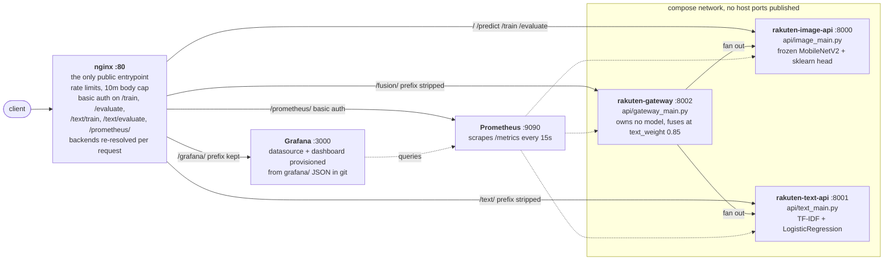
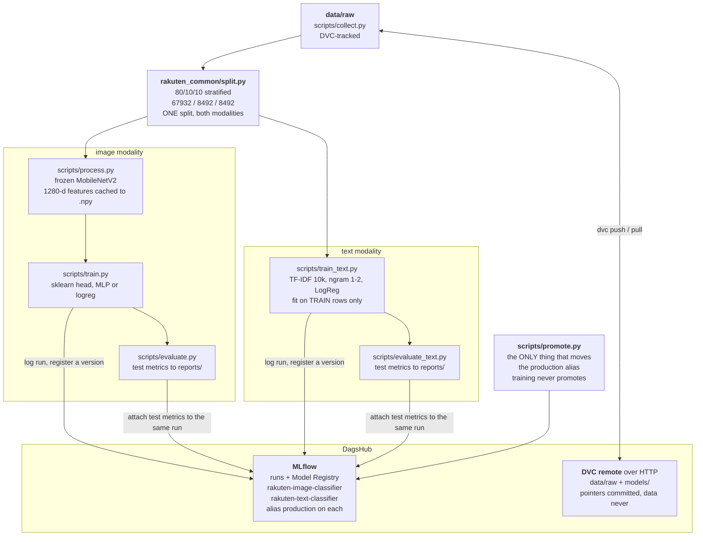
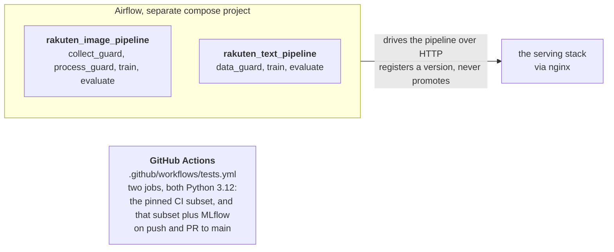

# Rakuten Product Classification: MLOps (image + text + fusion)

This repository holds the **MLOps phase** of our group's *Rakuten France
Multimodal Product Data Classification* project (ENS Challenge Data #35). It
predicts a product `prdtypecode` (27 classes) from a product **image**, from its
**text** (designation + description), or from **both** via late fusion.

> **Why the repository is shaped this way** lives in
> [`docs/decisions.md`](docs/decisions.md). This file is the instructions.

## Architecture

These diagrams are mermaid, rendered by GitHub from the source below. They
replace an exported PNG that could only be regenerated by hand and was stale
for four sessions before anyone noticed. Deliberately no test counts, model
versions or timings here: those are the parts that rot, and they live in the
sections that own them.

**Serving.** One public port, five backends, none of them reachable directly.



The gateway owns no model. It fans out, then combines the two probability
vectors at `text_weight` 0.85, and it refuses to fuse if either upstream
reports a class order that differs from `CANONICAL_CLASSES`. Both model
services resolve the `production` alias first, then the newest registered
version, then the local artifacts, and they do it eagerly at startup rather
than on the first request.

**Training and tracking.** One split feeds both modalities.



**Orchestration and CI.** Both modalities are orchestrated.



This is a deliberately **lighter re-implementation** of the modelisation work
(which trained LeNet / VGG16 / EfficientNetB3 on a rented H100). Instead of
training a heavy CNN it uses a **frozen MobileNetV2 backbone as a feature
extractor** with a small scikit-learn head, and a **TF-IDF + LogisticRegression**
text model. That choice is what makes the whole thing run on a modest laptop
(2 cores, 8 GB RAM) and makes the `/train` endpoint return in seconds.

The deliverable is a **working, reproducible, observable pipeline**, not a new
SOTA score.

---

## Results (measured, not estimated)

All figures come from the shared held-out **test** split (8492 products the
models never saw), except the image number, which is the val figure recorded in
the registry.

| model | accuracy | f1_weighted | f1_macro |
|---|---|---|---|
| image (MobileNetV2 + MLP head) | - | **0.5468** *(val)* | - |
| text (TF-IDF + LogReg) | 0.7768 | **0.7780** | 0.7564 |
| **fusion @ text_weight 0.85** | **0.7990** | **0.7973** | 0.7794 |

Fusion beats text alone by **+0.0193 weighted F1**.

---

## Project structure

```
rakuten-image-mlops/
├── data/raw/                  # collect.py lands raw data here (gitignored, DVC-tracked)
├── data/processed/            # cached feature .npy + meta (gitignored)
├── models/                    # image_classifier.joblib + models/text/ (DVC-tracked)
├── reports/                   # metrics, classification reports, confusion matrices
│
├── src/rakuten_common/        # modality-agnostic: no torch, no estimators
│   ├── split.py               # THE split: load, split, split_labels
│   ├── contract.py            # to_canonical(), validate_vector()
│   ├── features.py            # cached-feature row -> productid mapping, re-verified
│   ├── fusion.py              # weighted_average(), DEFAULT_TEXT_WEIGHT = 0.85
│   └── observability.py       # pure-ASGI Prometheus middleware (no fastapi import)
├── src/rakuten_img/           # image modality
│   ├── config.py  images.py  data.py
│   ├── backbone.py            # frozen MobileNetV2 (the only module importing torch)
│   ├── classifier.py          # build/save/load head, reorder to canonical order
│   ├── tracking.py            # all MLflow code for this modality
│   └── ens_download.py
├── src/rakuten_text/          # text modality (library only, no entrypoints)
│   ├── config.py  preprocessing.py  predict.py
│   └── tracking.py            # all MLflow code for this modality
│
├── scripts/                   # EVERY entrypoint lives here, both modalities
│   ├── collect.py  process.py  train.py  evaluate.py  predict.py   # image
│   ├── train_text.py  evaluate_text.py                             # text
│   ├── promote.py             # the ONLY thing that moves the production alias
│   ├── check_split.py         # proves the shared split matches the image split
│   ├── tune_fusion_weight.py  # measures the fusion weight
│   ├── check_ci_pins.py       # requirements-ci.txt must not drift
│   └── gen_dashboard.py       # generates + validates the Grafana dashboard JSON
│
├── api/image_main.py          # FastAPI :8000  /predict /train /evaluate /health
├── api/text_main.py           # FastAPI :8001  /predict /predict/batch /train /evaluate /health
├── api/gateway_main.py        # FastAPI :8002  /predict (fusion) /health
├── nginx/default.conf         # the only public entrypoint
├── prometheus/prometheus.yml  # scrape config (bind-mounted, needs a restart to reload)
├── grafana/provisioning/      # datasource + dashboard provider, read-only
├── grafana/dashboards/        # dashboard JSON, versioned here not in Grafana's DB
├── airflow/dags/              # rakuten_image_pipeline + rakuten_text_pipeline
├── docs/decisions.md          # the reasoning behind the choices described here
├── .github/workflows/tests.yml
├── tests/                     # torch-free and data-free (count not stated on purpose)
└── requirements.txt  requirements-ci.txt  pytest.ini  Dockerfile  docker-compose*.yml  Makefile
```

---

## Setup (WSL2 + venv)

PyTorch is installed separately because the correct wheel is hardware-specific.

```bash
make setup            # creates .venv, installs CPU torch + requirements
# or manually:
python3 -m venv .venv && source .venv/bin/activate
pip install torch==2.2.2 torchvision==0.17.2 --index-url https://download.pytorch.org/whl/cpu
pip install -r requirements.txt
```

Run the tests (need neither torch nor data):

```bash
make test             # the whole suite
```

> **Pins are load-bearing, but only one of them is forced.** `numpy` stays `<2`
> because torch 2.2.2 requires it, and that one cannot move. `scikit-learn==1.4.2`
> and `scipy==1.17.1` are pinned for REPRODUCIBILITY: the shipped models were
> fitted by that pair, and a solver or estimator change would move every metric
> derived from them without any change to our own code. Moving them is now a
> decision, not a breakage. It used to be a trap: `classifier.py` passed
> `multi_class=` and `n_jobs=` to `LogisticRegression`, both removed or going in
> newer releases, so the suite failed outright on scikit-learn 1.9 with
> `TypeError: ... unexpected keyword argument 'multi_class'`. Both arguments were
> measured to be no-ops on 1.4.2 and deleted; the suite passes on 1.9.0.

---

## Usage

### Image pipeline

```bash
# 1. Acquire raw data into data/raw/ (idempotent; re-runs are no-ops)
python scripts/collect.py --source /path/to/rakuten/data      # local folder or .zip
python scripts/collect.py --from-ens                          # authenticated ENS download
dvc pull                                                      # or: the exact versioned data

# 2. Extract & cache MobileNetV2 features (the long step; resumable)
python scripts/process.py
python scripts/process.py --limit 540      # quick smoke run

# 3. Train the head on cached features (fast)
python scripts/train.py
RAKUTEN_CLASSIFIER=logreg python scripts/train.py

# 4. Evaluate -> reports/ (+ attaches test metrics to the SAME MLflow run)
python scripts/evaluate.py

# 5. Predict on a new image
python scripts/predict.py --image path/to/product.jpg --top-k 5
```

### Text pipeline

```bash
python scripts/train_text.py                  # ~3 min on 2 cores
python scripts/evaluate_text.py               # scores the TEST split, ~20s
python scripts/evaluate_text.py --split val   # re-score val
```

`--max-features` is the only training flag. `--test-size` and `--full` were
removed deliberately: a flag that cannot change the shared split is a lie.

### Fusion

```bash
python scripts/tune_fusion_weight.py        # sweeps the weight on val, ~19s
```

All of the above are also `make` targets, so run `make help`.

---

## Serving: three services behind one proxy

Nginx on **:80** is the only public entrypoint. **No service publishes a host
port.** The prefix is stripped by the trailing slash on both the `location` and
the `proxy_pass` target.

| route | goes to | notes |
|---|---|---|
| `/` `/predict` `/train` `/evaluate` | image service | unchanged legacy paths; the Airflow DAG drives these |
| `/text/...` | text service | prefix stripped |
| `/fusion/...` | gateway | prefix stripped; fans out to both services |
| `/grafana/...` | Grafana | prefix **preserved**, Grafana serves under the sub-path |
| `/prometheus/...` | Prometheus | prefix stripped; **basic auth** |

`/text`, `/fusion`, `/grafana` and `/prometheus` without the trailing slash
301-redirect to the slashed form. Basic auth guards `/train`, `/train/status`,
`/evaluate`, `/evaluate/status`, their `/text/` counterparts and `/prometheus/`.
Rate limits are per-IP:
10r/s general (burst 20), 1r/s on train (burst 5), 30r/s on the monitoring UIs
(burst 60), `limit_req_status 429`. Body cap 10 MB.

**Note the trailing-slash asymmetry.** `/text/`, `/fusion/` and `/prometheus/`
strip their prefix (trailing slash on `proxy_pass`); `/grafana/` does **not**,
because Grafana runs with `GF_SERVER_SERVE_FROM_SUB_PATH=true` and expects to
receive the prefix. Getting this backwards 404s every asset.

```bash
curl -s -F "file=@product.jpg" "http://localhost/predict?top_k=3"
curl -s -X POST -H "Content-Type: application/json" \
     -d '{"designation":"Zzz","description":"..."}' "http://localhost/text/predict"
curl -s -F "file=@product.jpg" -F "designation=Zzz" "http://localhost/fusion/predict"
```

The gateway owns no model. It calls both services over HTTP, checks their
declared class order, and fuses at 0.85. If one upstream fails it returns the
other with `degraded=true` plus an `errors` block; if both fail, 502.

---

## Docker

Six services: three FastAPI apps (all from the **same image**, with per-service
`command:` overrides), nginx, Prometheus and Grafana.

```bash
# one-time: create the basic-auth file (gitignored)
printf "admin:$(openssl passwd -apr1)\n" > nginx/.htpasswd

docker compose build
docker compose up -d
docker compose ps           # all six should read (healthy)
curl http://localhost/health
curl http://localhost/text/health
curl http://localhost/fusion/health
```

Nginx waits for all five backends to be *healthy*, not merely started. Memory
limits, measured with `docker stats` during a live fusion request:

| container | measured | limit |
|---|---|---|
| rakuten-image-api | 120 MiB idle / 389 MiB serving / ~1.5 GiB retraining | 2.5g |
| rakuten-text-api | 157 MiB | 1g |
| rakuten-gateway | 50 MiB | 512m |
| rakuten-nginx | 5.3 MiB | 128m |

All eight containers including the Airflow stack total ~1.04 GiB against a
4.807 GiB WSL2 ceiling. Prometheus and Grafana are not in the table; both are
capped at 512m in `docker-compose.yml` and the Prometheus figure is marked
provisional there. The text and gateway limits are generous rather than
tight; re-measure before lowering. Too tight a limit shows up as a retrain
OOM-killed midway, not an obvious error.

Secrets are injected at **runtime** via `env_file: .env`; `.env` and `.dvc/` are
excluded by `.dockerignore`, so credentials are never baked into image layers.

> ⚠️ **Nginx does not reload a bind-mounted config.** After editing
> `nginx/default.conf` you **must** run `docker compose restart nginx`. The tell
> that you forgot: `/text/health` returns FastAPI's `{"detail":"Not Found"}`.
> A 404 *body* means you reached a FastAPI app, just the wrong one.

---

## Monitoring (Prometheus + Grafana)

All three services expose `/metrics`. Prometheus scrapes them every 15s over the
compose network and Grafana renders one provisioned dashboard. Neither publishes
a host port. Both are reached through nginx.

| URL | auth |
|---|---|
| `http://localhost/grafana/` | Grafana's own login (`GRAFANA_ADMIN_*` from `.env`) |
| `http://localhost/prometheus/` | nginx basic auth (`nginx/.htpasswd`) |

**There are three different passwords in this stack.** They are not
interchangeable and mixing them up costs time:

| password | lives in | opens |
|---|---|---|
| nginx basic auth | `nginx/.htpasswd` (hashed, unreadable) | `/train`, `/evaluate`, `/text/train`, `/text/evaluate`, `/prometheus/` |
| Grafana admin | `GRAFANA_ADMIN_PASSWORD` in `.env` | the Grafana login page |
| DagsHub token | `MLFLOW_TRACKING_PASSWORD` in `.env` | MLflow tracking + DVC remote |

Reset the first with `printf "admin:$(openssl passwd -apr1)\n" > nginx/.htpasswd`
(it prompts; run it on its own line). The file stores only a hash, so a
forgotten password can only be replaced, never recovered.

### What is measured

| metric | labels | what it answers |
|---|---|---|
| `rakuten_http_requests_total` | `service, method, path, status` | traffic and error rate |
| `rakuten_http_request_duration_seconds` | `service, method, path` | latency (buckets to 120s) |
| `rakuten_predictions_total` | `service, prdtypecode` | what the system predicts, per class |
| `rakuten_prediction_confidence` | `service` | how confident it is |
| `rakuten_model_info` | `service, modality, source` | **which model each service is serving** |
| `rakuten_upstream_failures_total` | `service, upstream` | gateway calls that failed |
| `rakuten_fusion_requests_total` | `service, modalities, fused, degraded` | how often one modality is silently missing |

`rakuten_model_info` is the dashboard counterpart of `/health`'s `model_source`:
it reads from the running process, not from disk. The metric keeps its
`modality` label, and grouping by it is useful, but the dashboard's serving table
hides that column, because it duplicates `service` on every row except the
gateway's (`fusion` vs `gateway`). Both model services report a real source from
boot, because both resolve in their lifespan, so `not-loaded` means an actual
failure to resolve anything rather than a service nobody has called yet.

The `path` label is always the **route template** (`/predict`), never the raw
URL, and anything unmatched is recorded as `unmatched`. That is deliberate:
labelling by raw path would let any caller mint unbounded label values by
requesting random URLs, which is how a Prometheus server gets killed.

### Editing the configuration

Neither `prometheus/prometheus.yml` nor `grafana/provisioning/` is re-read while
running, and both are bind-mounted:

```bash
sudo docker compose restart prometheus   # after editing the scrape config
sudo docker compose restart grafana      # after editing provisioning or a dashboard
```

Dashboards are provisioned from `grafana/dashboards/*.json` with
`allowUiUpdates: false`. Edit the JSON and restart; changes made in the browser
would be silently reverted, which is worse than being refused.

`rakuten-overview.json` is **generated**, not hand-written. `make dashboard`
(or `python scripts/gen_dashboard.py`). 13 panels on a 24-column grid is more
geometry than a person can hold in their head, and none of it is checkable by
CI: a dashboard is data, not code. The generator asserts what a browser would
otherwise be the first to tell you: unique panel ids, no overlapping cells,
nothing past column 24, one consistent datasource uid, and every instant query
feeding a table carrying `format: "table"` (without it the panel renders "No
data" even though the query is correct, and three panels shipped that way once).

`python scripts/gen_dashboard.py --check` writes nothing and exits non-zero if
the committed JSON and the generator disagree. Run it after any dashboard edit;
if you edited the JSON by hand, fold the change into the script instead.

---

## Experiment tracking & data versioning (DagsHub)

One account token drives three things:

- **MLflow tracking**: `train.py` logs params and train/val metrics;
  `evaluate.py` reopens the **same run** (the run_id is stored in the saved model
  payload) and attaches test metrics, the classification report and the confusion
  matrix. One run tells the full story. Both modalities do this.
- **Model Registry**: two registered models: `rakuten-image-classifier`
  (`production` -> v2) and `rakuten-text-classifier`
  (`production` -> v1). Both are served alias-first; promoting the text model did
  not move image serving at all.
- **DVC**: `data/raw` and `models` are tracked and pushed to the DagsHub remote
  over HTTP. Pointer files are committed; the data never is.

Everything is **best-effort by design**: if `MLFLOW_TRACKING_URI` is unset or the
server is unreachable, training and evaluation run normally and the model is
still saved locally. Tracking never blocks the pipeline.

**Teammate setup:** create a DagsHub account, grab your token, put it in `.env`
(as `MLFLOW_TRACKING_PASSWORD`) *and* `.dvc/config.local` (as the DVC password).
Both files are gitignored. Each person uses their own token.

### Configuration (env vars)

| Variable | Default | Meaning |
|---|---|---|
| `RAKUTEN_RAW_SOURCE` | - | default `--source` for collect.py |
| `RAKUTEN_DATA_DIR` | `./data` | data root |
| `RAKUTEN_MODELS_DIR` | `./models` | where classifiers are saved |
| `RAKUTEN_REPORTS_DIR` | `./reports` | where evaluate.py writes results |
| `RAKUTEN_CLASSIFIER` | `mlp` | `mlp` or `logreg` (image head) |
| `RAKUTEN_FEATURE_BATCH` | `64` | backbone batch size |
| `RAKUTEN_REGISTERED_MODEL` | `rakuten-image-classifier` | registry name (image) |
| `RAKUTEN_PRODUCTION_ALIAS` | `production` | alias consulted first when serving |
| `MLFLOW_TRACKING_URI` | - | DagsHub MLflow endpoint; unset = tracking off |
| `MLFLOW_TRACKING_USERNAME` / `_PASSWORD` | - | DagsHub username / token |
| `MLFLOW_EXPERIMENT_NAME` | `rakuten-image` | experiment for the image runs |
| `RAKUTEN_TEXT_REGISTERED_MODEL` | `rakuten-text-classifier` | registry name (text) |
| `RAKUTEN_TEXT_EXPERIMENT` | `rakuten-text` | experiment for the text runs |
| `MLFLOW_HTTP_REQUEST_MAX_RETRIES` | `2` when serving | capped so a dead registry cannot hang startup |
| `MLFLOW_HTTP_REQUEST_TIMEOUT` | `10` when serving | same reason |
| `GRAFANA_ADMIN_USER` | `admin` | Grafana login user |
| `GRAFANA_ADMIN_PASSWORD` | **none, required** | compose refuses to start without it, rather than falling back to Grafana's `admin/admin` |
| `GRAFANA_ROOT_URL` | `http://localhost/grafana/` | set this if you reach the host by LAN IP |
| `PROMETHEUS_EXTERNAL_URL` | `http://localhost/prometheus/` | same reason |
| `ENS_USERNAME` / `ENS_PASSWORD` | - | credentials for `collect.py --from-ens` |
| `ENS_BASE` | `https://challengedata.ens.fr` | ENS site base URL |
| `ENS_CHALLENGE_ID` | `35` | ENS challenge number |

Text artifacts go to `models/text/` and `reports/text/`; the text experiment is
`rakuten-text`. A real exported variable takes precedence over `.env`.

---

## Orchestration (Airflow)

Airflow runs as a **separate compose project** (`rakuten-airflow`, Airflow 3.3.0,
LocalExecutor) and talks to the API **over HTTP through nginx** with basic auth.
It does not import the pipeline code.

```bash
# .env.airflow must set AIRFLOW_UID to your host uid, or the containers
# write root-owned files into airflow/logs/ that you then cannot delete
echo "AIRFLOW_UID=$(id -u)" >> airflow/.env.airflow

docker compose -f docker-compose.yml up -d                    # the services
docker compose -f docker-compose.airflow.yml up -d            # the scheduler stack
```

**Both modalities are orchestrated**, one DAG each. Both are `schedule=None`,
`retries=0`, `max_active_runs=1`, and both register a new model version and
**never promote**:

| DAG | tasks |
|---|---|
| `rakuten_image_pipeline` | `collect_guard >> process_guard >> train >> evaluate` |
| `rakuten_text_pipeline` | `data_guard >> train >> evaluate` |

The image run was last timed at **~1015s**. The text run has not been timed since
the DAG was added. Nothing checks either number, so treat both as indicative.

> The dag-processor refresh interval is the default **300s**, so a new or edited
> DAG can take up to five minutes to appear.

---

## CI

`.github/workflows/tests.yml` runs on every push and pull request to `main`, on
Python 3.12, as **two jobs in parallel**:

| job | installs | runs |
|---|---|---|
| `pytest (python 3.12, pinned)` | `requirements-ci.txt` | everything except the real-registry tests |
| `pytest (python 3.12, with mlflow)` | the same, plus mlflow | the whole suite |

The first job installs a deliberate **subset** of `requirements.txt` that omits
mlflow, dagshub, dvc and the API stack, none of which the tests import (every
such import in `src/` is lazy). Measured: 128s and 995 MB for the full file
versus 65s and 467 MB for the subset. The tests that stand up a real MLflow
registry `importorskip` there rather than fail.

Exact pass and skip counts are deliberately NOT written here. Nothing checks a
number in a README, so it silently rots: this table claimed 62 pass and 17 skip
for months while the real figures were several times that.

The second job exists because those tests cover the rule that decides **which
model version serves traffic**, on both modalities. Too important to be
exercised only on a laptop. It pays the mlflow install so they actually run, and
it deliberately applies **no marker filter**: filtering on `-m slow` would let a
test whose marker someone forgot run in neither job and vanish from CI silently.
Its mlflow pin is read out of `requirements.txt` at run time, never written into
the workflow, so it cannot drift.

`scripts/check_ci_pins.py` runs **before** the install and fails if the two files
ever disagree on a version: a subset is only trustworthy if it cannot drift.

---

## Contributing

1. **Branch off `main`**: `git checkout -b your-feature`.
2. **Run `make test` before opening a PR**: it runs the whole suite. Use
   `make test-fast` (`-m "not slow"`) during the edit loop: it skips the tests
   that stand up a real MLflow registry, which are the bulk of the wall time.
   CI runs everything regardless, so a fast local pass is not a green build.
3. **Open a pull request into `main`** and wait for the check to go green.
4. **Never commit data or secrets.** `data/`, `models/`, `reports/`, `.env`,
   `.dvc/config.local`, `nginx/.htpasswd`, `airflow/.env.airflow` and
   `airflow/logs/` are gitignored on purpose. Don't force-add them. Stage files
   explicitly rather than with `git add -A`.
